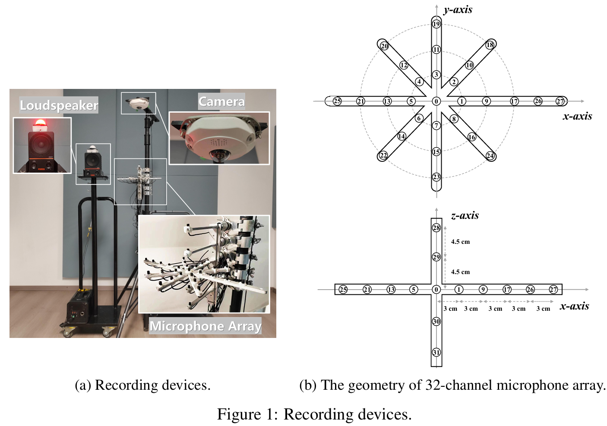

### RealMAN: A Real-Recorded and Annotated Microphone Array Dataset for Dynamic Speech Enhancement and Localization

- can be accessed on https://mab.to/uFs0WNo0hgrV6/us3 now.

- will also be avaliable on https://www.aishelltech.com/RealMAN in a few days.





This repository contains the code and download scripts for the RealMAN dataset.

<!-- ```
@Article{RealMAN2024,
  author    = {Bing Yang, Changsheng Quan, Yabo Wang, Pengyu Wang, Yujie Yang, Ying Fang, Nian Shao, Hui Bu, Xin Xu, Xiaofei Li},
  title     = {RealMAN: A Real-Recorded and Annotated Microphone Array Dataset for Dynamic Speech Enhancement and Localization},
  journal   = {},
  year      = {2024},
}
``` -->


### Dataset Description
The RealMAN dataset is a multi-channel microphone array dataset for dynamic speech enhancement and localization. Specifically, a 32-channel array with high-fidelity microphones is used for recording. A loudspeaker is used for playing source speech signals. A total of 83-hour speech signals (48 hours for static speaker and 35 hours of moving speaker) are recorded in 32 different scenes, and 144 hours of background noise are recorded in 31 different scenes. Both speech and noise recording scenes cover various common indoor, outdoor, semi-outdoor and transportation environments. The azimuth angle of the loudspeaker is annotated with an omni-direction fisheye camera, and is used for the training of source localization networks. The direct-path signal is obtained by filtering the played speech signal with an estimated direct-path propagation filter, and is used for the training of speech enhancement networks.


### Naming Convention

The dataset is organized into the following directory structure:

```
RealMAN
├── transcriptions.trn
├── dataset_info
│   ├── scene_images
│   ├── scene_info.json
│   └── speaker_info.csv
└── train/val/test/val_raw/test_raw
    ├── train_moving_source_location.csv
    ├── train_static_source_location.csv
    ├── dp_speech
    │   ├── BadmintonCourt2
    │   │   ├── moving
    │   │   │   ├── 0010
    │   │   │   │   ├── TRAIN_M_BAD2_0010_0003.flac
    │   │   │   │   └── ...
    │   │   │   └── ...
    │   │   └── static
    │   └── ...
    ├── ma_noisy_speech
    │   ├── BadmintonCourt2
    │   │   ├── moving
    │   │   │   ├── 0010
    │   │   │   │   ├── TRAIN_M_BAD2_0010_0003_CH0.flac
    │   │   │   │   └── ...
    │   │   │   └── ...
    │   │   ├── static
    │   └── ...
    └── ma_noise
```

The naming convention for the RealMAN dataset is as follows:

```
# Recorded Signal
TRAIN/VAL/TEST_M/S_scene_speakerId_utteranceId_channelId.flac

# Direct-Path Signal
TRAIN/VAL/TEST_M/S_scene_speakerId_utteranceId.flac

# Source Location
train/val/test_moving/static_source_location.csv
```

### Download Scripts

The download scripts for the RealMAN dataset are available in the `download_scripts` directory. The scripts can be used to download the entire dataset or individual recordings. The scripts use the `wget` command to download the files from the Google Drive links provided in the dataset description.

To download the entire dataset, run the following command:

```
./download_all.sh
```

To download a specific recording, run the following command:

```
./download_recording.sh device_recording_date_location_microphone_array_version
```

For example, to download the recording from the SM1 device recorded on January 1st, 2020 in Berlin, run the following command:

```
./download_recording.sh RealMAN_SM1_2020-01-01_Berlin_SM1_v1
```
