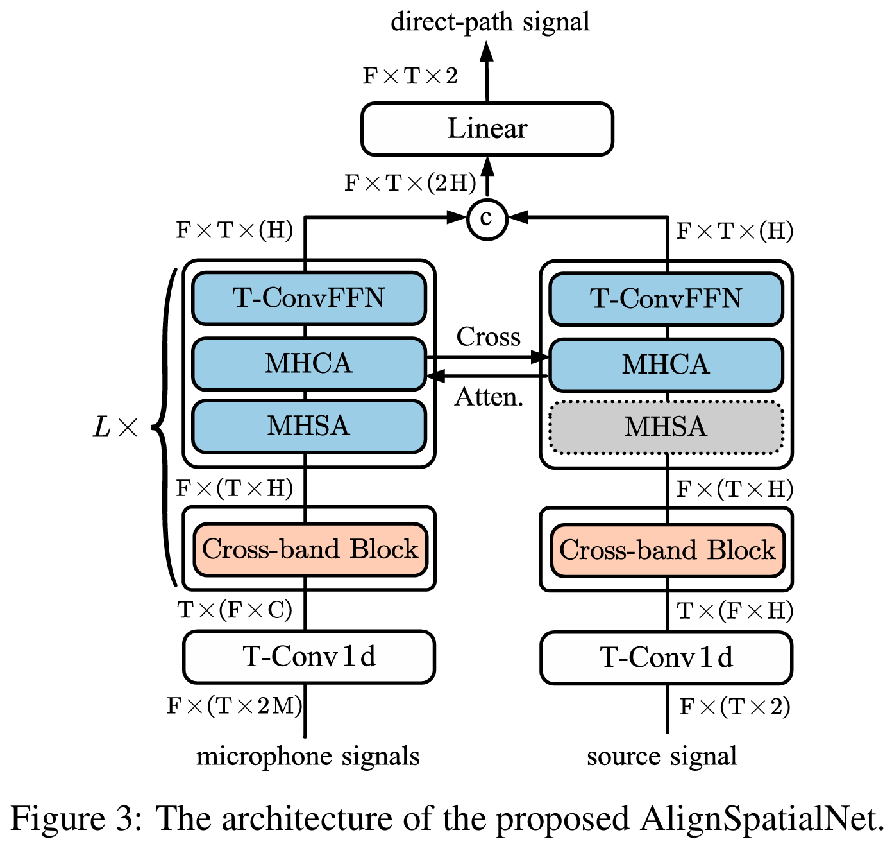

### FaSNet-TAC
please see [yluo42/TAC](https://github.com/yluo42/TAC).

### SpatialNet-tiny

In RealMAN paper, we use a tiny version of SpatialNet [1] as our baseline model, where the hidden size of the SpatialNet-small version reported in the paper [1] is further reduced from 96 to 48. See `https://github.com/Audio-WestlakeU/NBSS` for example usage.

| Code | Description |
| --- | --- |
| `models/arch/SpatialNet.py` | The network implementation of AlignSpatialNet. Configs: `configs/SpatialNetTiny.yaml` |
| `data_loaders/baseline_realistic_audio.py` | The reference dataloader implementation. Configs: `configs/datasets/baseline_realistic_audio_16k.yaml` |
| `SharedTrainer.py` | The pytorch-lightning Trainer implementation.|

[1] Changsheng Quan, Xiaofei Li. [SpatialNet: Extensively Learning Spatial Information for Multichannel Joint Speech Separation, Denoising and Dereverberation](https://arxiv.org/abs/2307.16516). TASLP, 2024.

### AlignSpatialNet
We propose a network named AlignSpatialNet for source-signal guided direct-path speech estimation. As shown in Fig. 3, the network has two branches, one for the recorded microphone signals and one for the played source clean speech signal. Each branch is extended from our previously proposed SpatialNet [1]. Besides the neural components from SpatialNet, i.e. the cross-band block, the multi-head self-attention module (MHSA) and the time-convolutional feedforward network (T-ConvFFN), each branch also contains multi-head cross-attention module (MHCA) for extracting the spatial cues,i.e. time shift and level attenuation, between the played source signal and the recorded microphone signals.

| Code | Description |
| --- | --- |
| `models/arch/AlignSpatialNet.py` | The network implementation of AlignSpatialNet. Configs: `configs/AlignSpatialNet.yaml` |
| `data_loaders/align_wav.py` | The reference dataloader implementation. Configs: `configs/datasets/align_wav.yaml` |
| `SharedTrainerAlignWav.py` | The pytorch-lightning Trainer implementation.|

See `https://github.com/Audio-WestlakeU/NBSS` for example usage.

`logs/AlignSpatialNet/version_15` and `logs/AlignSpatialNet/version_16` contain the checkpoints and configs of the pre-trained AlignSpatialNet model for moving speaker and static speaker respectively.

### ASR Evaluation
The ASR performances are evaluated by an established ASR model trained by over 10,000 hours of Mandarin dataset, [WenetSpeech](https://arxiv.org/abs/2110.03370) using [ESPNet toolkit](https://github.com/espnet/espnet).
| Code | Description |
| --- | --- |
| `asr_evaluate/0_inference.py` | Use the ESPnet toolkit and the established ASR model for ASR inference on enhanced speech. |
| `asr_evaluate/1_convert_json_to_trn.py` | Convert *.json' file generated by 'asr_evaluate/0_inference.py' to '*.trn'. |
| `asr_evaluate/2_filter_trn_by_scene.py` | Filter the reference transcript file in the RealMAN dataset to each test scene.|
| `asr_evaluate/3_calculate_cer.py` | Calculate CER using sclite given the path of enhanced trn and reference trn.|
| `asr_evaluate/4_summariza_results` | Summarize CER results in 'summary.md'.|
